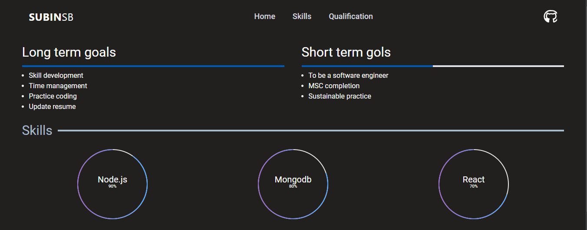
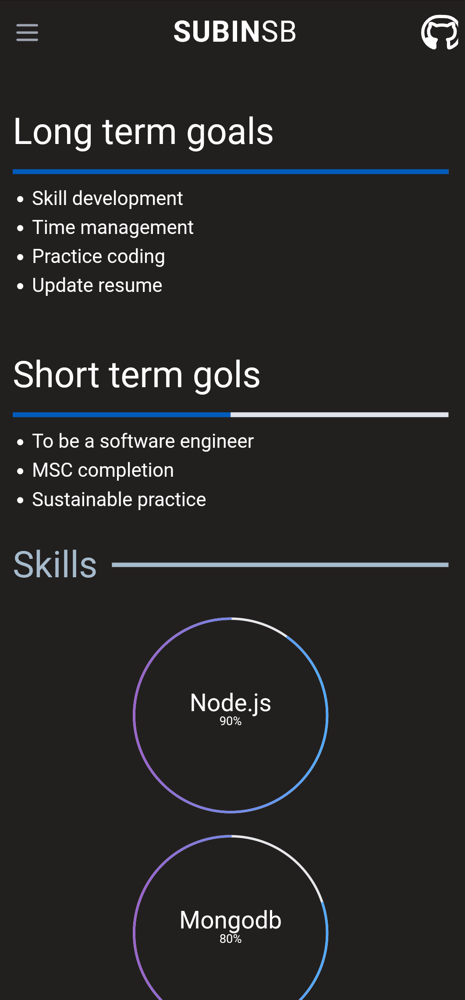

# Angularcli

This project was generated with [Angular CLI](https://github.com/angular/angular-cli) version 18.2.11.

## Demo
https://subinn.netlify.app/

## Images


## Mobile view


## Development server

Run `ng serve` for a dev server. Navigate to `http://localhost:4200/`. The application will automatically reload if you change any of the source files.

## Code scaffolding

Run `ng generate component component-name` to generate a new component. You can also use `ng generate directive|pipe|service|class|guard|interface|enum|module`.

## Build

Run `ng build` to build the project. The build artifacts will be stored in the `dist/` directory.

## Running unit tests

Run `ng test` to execute the unit tests via [Karma](https://karma-runner.github.io).

## Running end-to-end tests

Run `ng e2e` to execute the end-to-end tests via a platform of your choice. To use this command, you need to first add a package that implements end-to-end testing capabilities.

## Further help

To get more help on the Angular CLI use `ng help` or go check out the [Angular CLI Overview and Command Reference](https://angular.dev/tools/cli) page.


### 🔧 Built With

- [**AngularCLI**](https://angular.dev/cli): A powerful library for building UI components.
- [**Vite**](https://vitejs.dev/): A blazing fast frontend build tool, making the development process a breeze.
- [**Tailwind CSS**](https://tailwindcss.com/): A utility-first CSS framework for rapidly building modern user 


### 🛠️ Local Setup

You can set up this project locally by following these steps:

```
git clone https://github.com/Subin-sb1/Portfolio-angular.git
cd portfolio-angular
npm install
ng serve
```
